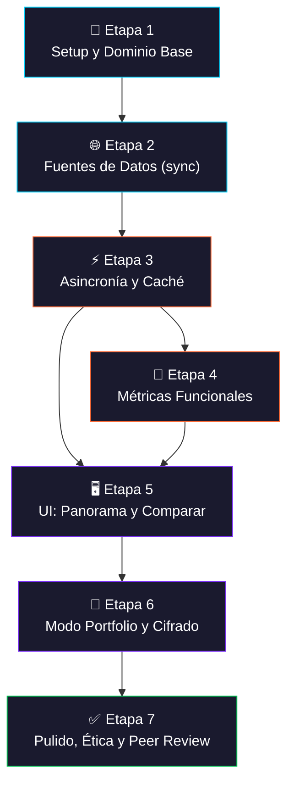
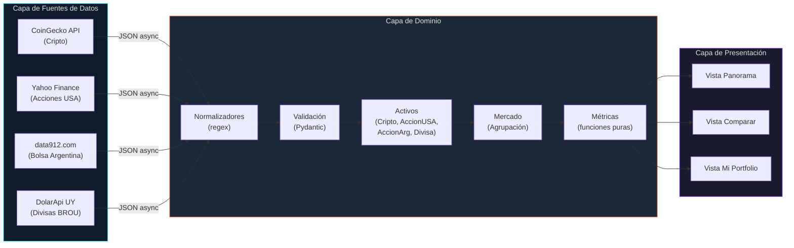
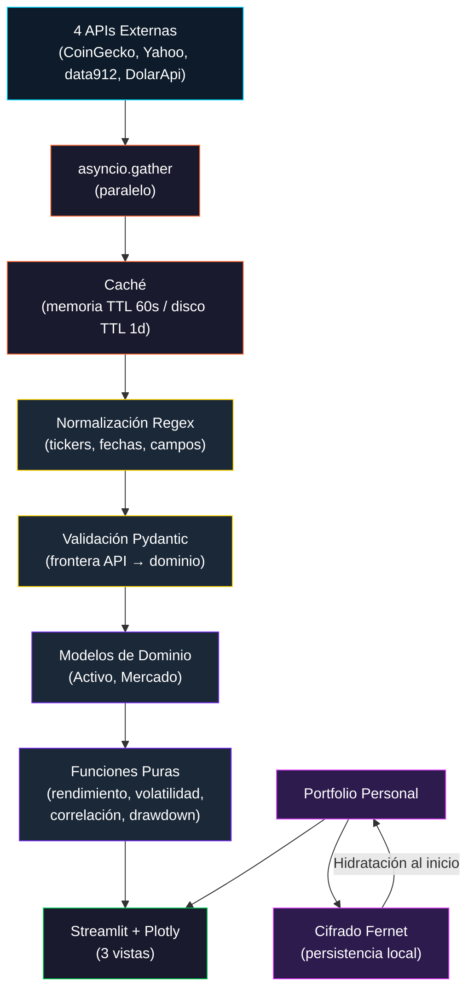

# Pipeline — Observatorio Financiero LATAM (V2)

> Proyecto Final — Programación Científica y Técnica 2026
>
> **V2 (2026-05-19):** ajustes de coherencia con `PROYECTO V2.md` y `diagramas_uml V2.html`. Cambios principales: orden regex → Pydantic en los flowcharts (la limpieza precede a la validación), `AlmacenCifrado` modelado como clase OOP, export XML del portfolio agregado a la directriz 7.1, registro explícito de `RegistroFuentes` y schemas Pydantic en la capa de fuentes.

---

## Diagrama General del Pipeline

---

## Arquitectura de 3 Capas

---

## Detalle por Etapa

---

### Etapa 1 — Setup y Dominio Base 🔧

| Aspecto | Detalle |
|---|---|
| **Objetivo** | Configurar repo, estructura de carpetas, clases abstractas |
| **Directriz académica** | 7.2 — OOP, herencia, abstracción |
| **Dependencias** | Ninguna (punto de partida) |

**Tareas:**
- [ ] Crear repositorio con `pyproject.toml`, `.gitignore`, `README.md`
- [ ] Crear estructura completa de carpetas (`src/observatorio/...`)
- [ ] Implementar ABC `FuenteDatos` en `core/fuente.py`
- [ ] Implementar ABC `Activo` en `core/activo.py`
- [ ] Implementar clase `Mercado` en `core/mercado.py`
- [ ] Crear `core/tipos.py` con enums y dataclasses compartidas
- [ ] Crear `core/excepciones.py` con `ObservatorioError` base
- [ ] Configurar `.streamlit/config.toml` con tema visual
- [ ] Crear tests vacíos pero funcionales con pytest
- [ ] Configurar `ruff` y `mypy`

**Hito:** ✅ El proyecto importa, los tests corren (0 tests reales), `streamlit run` muestra pantalla básica.

**Entregable portafolio:** `docs/portafolio/etapa-1.md`

---

### Etapa 2 — Fuentes de Datos (síncrono) 🌐

| Aspecto | Detalle |
|---|---|
| **Objetivo** | Conectar las 4 APIs de forma síncrona, validar respuestas |
| **Directriz académica** | 7.1 — Recolección de datos, JSON, regex; 7.3 — APIs REST |
| **Dependencias** | Etapa 1 |

**Tareas:**
- [ ] Implementar `CoinGeckoAPI` en `fuentes/coingecko.py`
- [ ] Implementar `YahooFinanceAPI` en `fuentes/yahoo_finance.py`
- [ ] Implementar `Data912API` en `fuentes/data912.py`
- [ ] Implementar `DolarApiUY` en `fuentes/dolar_api_uy.py`
- [ ] **Paso 1 (limpieza con regex)** — implementar normalizadores en `normalizadores/`:
  - [ ] `tickers.py` — normalización de símbolos (BTC, BTC-USD, BTCUSDT → BTC)
  - [ ] `fechas.py` — parsing de fechas heterogéneas (ISO 8601, Unix, custom)
  - [ ] `validadores.py` — validación de inputs del usuario
- [ ] **Paso 2 (validación con Pydantic)** — modelos en `fuentes/esquemas.py`:
  - [ ] `CotizacionDTO`, `PuntoPrecioDTO`, `HistoricoDTO`
  - [ ] Aplicar validación sobre los datos ya limpios por regex (orden importa: limpieza precede a la validación)
- [ ] Implementar activos concretos con atributos específicos:
  - [ ] `Cripto(market_cap, ranking)`
  - [ ] `AccionUSA(sector)`
  - [ ] `AccionArg(panel)` — requiere tasa ARS/USD para `precio_actual_usd`
  - [ ] `Divisa(par, tipo_cotizacion)`
- [ ] Tests con respuestas mockeadas de las APIs
- [ ] Documentar hallazgos (rate limits, formatos) en `docs/decisiones.md`

**Hito:** ✅ Script standalone que pega a las 4 APIs e imprime precio actual de un activo de cada una.

**Entregable portafolio:** `docs/portafolio/etapa-2.md`

---

### Etapa 3 — Asincronía y Caché ⚡

| Aspecto | Detalle |
|---|---|
| **Objetivo** | Refactor a async, implementar caché, benchmark sync vs async |
| **Directriz académica** | 7.3 — Programación asincrónica |
| **Dependencias** | Etapa 2 |

**Tareas:**
- [ ] Refactorizar `FuenteDatos` (ABC) para exponer `precio_actual_async` además del sync
- [ ] Refactorizar las 4 fuentes concretas a async con `aiohttp` (Yahoo se mantiene sync envuelto en `asyncio.to_thread`)
- [ ] Implementar sesión `aiohttp` reutilizable por fuente
- [ ] Implementar `Mercado.refrescar_precios_async()` con `asyncio.gather` para refresh paralelo
- [ ] Implementar decorador de caché con TTL en `fuentes/cache.py`
  - [ ] Caché en memoria (TTL 60s) para precios actuales
  - [ ] Caché en disco (parquet, TTL 1 día) para históricos
- [ ] Implementar `RegistroFuentes` en `fuentes/registro.py` — patrón Registry que mapea símbolo → fuente y aísla a las vistas de las implementaciones concretas
- [ ] Crear `scripts/benchmark_async.py`
- [ ] Correr benchmark y documentar resultados en `docs/benchmark.md`

**Hito:** ✅ Operación "refrescar todo" tarda < mitad que versión sync. Números en `docs/benchmark.md`.

**Entregable portafolio:** `docs/portafolio/etapa-3.md`

---

### Etapa 4 — Métricas Funcionales 📐

| Aspecto | Detalle |
|---|---|
| **Objetivo** | Implementar todas las funciones puras de cálculo financiero |
| **Directriz académica** | 7.3 — Programación funcional (`map`, `filter`, `reduce`) |
| **Dependencias** | Etapa 3 (usa datos cacheados para probar) |

**Tareas:**
- [ ] `metricas/rendimiento.py` — `calcular_rendimiento_porcentual()`
- [ ] `metricas/volatilidad.py` — `calcular_volatilidad()`
- [ ] `metricas/correlacion.py` — `calcular_correlacion()`
- [ ] `metricas/drawdown.py` — `calcular_drawdown_maximo()`
- [ ] `metricas/normalizacion.py` — `normalizar_a_base()`
- [ ] `metricas/conversion.py` — `convertir_moneda()`
- [ ] Usar `map`, `filter`, `functools.reduce` en pipelines de procesamiento
- [ ] Tests unitarios exhaustivos por cada función:
  - [ ] Caso típico
  - [ ] Lista vacía
  - [ ] Un solo elemento
  - [ ] Valores extremos (todos iguales, ceros)

**Hito:** ✅ Cobertura de tests del módulo `metricas/` > 90%.

**Entregable portafolio:** `docs/portafolio/etapa-4.md`

---

### Etapa 5 — UI: Panorama y Comparar 🖥️

| Aspecto | Detalle |
|---|---|
| **Objetivo** | Implementar las 2 vistas principales con Streamlit + Plotly |
| **Directriz académica** | Integración de todas las anteriores en producto usable |
| **Dependencias** | Etapas 3 y 4 |

**Tareas:**
- [ ] Crear `ui/app.py` — entrypoint de Streamlit con navegación
- [ ] **Vista Panorama** (`ui/vistas/panorama.py`):
  - [ ] 4 metric cards (Dólar BROU, Bitcoin, Merval, S&P 500)
  - [ ] Gráfico de líneas comparativo normalizado base 100
  - [ ] Selector de período (7d, 30d, 1 año)
  - [ ] Sección "Insights del día" (tarjetas narrativas dinámicas)
  - [ ] Disclaimer permanente al pie
- [ ] **Vista Comparar** (`ui/vistas/comparar.py`):
  - [ ] Multi-select de activos de cualquier mercado
  - [ ] Gráfico de líneas normalizadas
  - [ ] Tabla de métricas con tooltips explicativos
  - [ ] Heatmap de correlaciones (Plotly)
  - [ ] Explicación narrativa dinámica
- [ ] **Componentes reutilizables** (`ui/componentes/`):
  - [ ] `metric_card.py` — métrica con sparkline
  - [ ] `grafico_lineas.py` — wrapper Plotly con tema custom
  - [ ] `heatmap.py` — paleta accesible (daltonismo)
  - [ ] `disclaimer.py` — banner legal
- [ ] `ui/glosario.py` — tooltips y definiciones en lenguaje simple

**Hito:** ✅ Una persona sin formación financiera puede usar la app y entender lo que ve.

**Entregable portafolio:** `docs/portafolio/etapa-5.md`

---

### Etapa 6 — Modo Portfolio y Cifrado 💼

| Aspecto | Detalle |
|---|---|
| **Objetivo** | Vista "Mi Portfolio", persistencia cifrada, import/export CSV |
| **Directriz académica** | 7.1 — CSV; 7.4 — Ética (datos personales cifrados) |
| **Dependencias** | Etapa 5 |

**Tareas:**
- [ ] Implementar `core/portfolio.py`:
  - [ ] Clase `Tenencia(activo, cantidad, precio_compra)` con método `valor_actual(tasas)`
  - [ ] Clase `Portfolio(nombre, tenencias, moneda_base)` con métodos `agregar_tenencia(t)`, `valor_total(tasas)`, `distribucion() -> dict`, `exportar_csv() -> str`, `exportar_xml() -> str`
  - [ ] Valor total en USD, UYU, ARS (usando `convertir_moneda` de `metricas/`)
- [ ] Implementar `persistencia/cifrado.py` (helpers de bajo nivel):
  - [ ] Funciones `cifrar(plano, password)` y `descifrar(token, password)` sobre Fernet (AES-128-CBC + HMAC-SHA256)
  - [ ] Función `derivar_clave(password, salt)` con PBKDF2-SHA256 (200k iter)
- [ ] Implementar **clase** `AlmacenCifrado` en `persistencia/almacen.py`:
  - [ ] Atributos: `ruta: Path`, `salt: bytes`
  - [ ] Métodos: `guardar(portfolio, password)`, `cargar(password) -> Portfolio`, `existe() -> bool`, `derivar_clave(password) -> bytes`
  - [ ] Encapsula los helpers de `cifrado.py` y el roundtrip a disco
- [ ] **Vista Mi Portfolio** (`ui/vistas/portfolio.py`):
  - [ ] Onboarding si no hay portfolio
  - [ ] 3 metric cards (valor total en USD, UYU, ARS)
  - [ ] Treemap de distribución (Plotly)
  - [ ] Tabla editable de tenencias (incluye precio de compra para P&L)
  - [ ] Gráfico de evolución del valor
  - [ ] Import/Export en **CSV y XML** (cumple directriz 7.1 con los 3 formatos del PDF: JSON en APIs + CSV + XML)
- [ ] Tests de cifrado, roundtrip de `AlmacenCifrado` y serialización CSV/XML

**Hito:** ✅ Portfolio cargado se persiste cifrado, sobrevive reinicio, no es legible sin clave.

**Entregable portafolio:** `docs/portafolio/etapa-6.md`

---

### Etapa 7 — Pulido, Ética y Peer Review ✅

| Aspecto | Detalle |
|---|---|
| **Objetivo** | Documentación final, análisis ético, preparación de entrega |
| **Directriz académica** | 7.4 — Ética completa; 7.5 — Proceso como producto |
| **Dependencias** | Etapa 6 |

**Tareas:**
- [ ] Escribir `docs/etica.md` extendido:
  - [ ] Análisis Ley 18.331 (Uruguay) y Ley 25.326 (Argentina)
  - [ ] Análisis BCU/RNMV y CNV
  - [ ] Sesgos del producto documentados
- [ ] Completar `docs/glosario.md` (versión usuario)
- [ ] Cerrar ADRs pendientes en `docs/adr/`
- [ ] Pulir `README.md` con instrucciones de instalación reproducibles
- [ ] Preparar `scripts/seed_demo.py` con datos de demo
- [ ] Preparar presentación de 15 minutos:
  - [ ] Bloque 1 (3 min): Problema y contexto
  - [ ] Bloque 2 (8 min): Demo en vivo
  - [ ] Bloque 3 (4 min): Arquitectura, benchmark, ética
- [ ] Sesión de peer review con compañero (`docs/peer-review/checklist.md`)
- [ ] Revisión final de disclaimers en toda la UI

**Hito:** ✅ App lista para presentar, repo listo para entrega.

**Entregable portafolio:** `docs/portafolio/etapa-7.md`

---

## Flujo de Datos

---

## Mapeo Directrices ↔ Etapas

| Directriz Académica | Etapa(s) | Evidencia |
|---|---|---|
| **7.1** Recolección y Procesamiento | E2, E6 | **JSON** (4 APIs) + **CSV** (export portfolio) + **XML** (export portfolio), regex en normalizadores, Pydantic en frontera |
| **7.2** OOP, Herencia, Polimorfismo | E1, E2, E6 | ABCs `FuenteDatos` y `Activo` con 4 implementaciones cada una, clase `AlmacenCifrado` |
| **7.3** APIs REST + Async + Funcional | E2, E3, E4 | 4 APIs REST, `aiohttp`+`asyncio.gather` en `Mercado.refrescar_precios_async()`, funciones puras con `map/filter/reduce` |
| **7.4** Ética y Responsabilidad | E6, E7 | Cifrado Fernet, disclaimers, `docs/etica.md`, análisis legal UY/AR |
| **7.5** Proceso como Producto | Todas | Portafolio por etapa, ADRs, peer review, Conventional Commits |

---

## Ruta Crítica

```mermaid
gantt
    title Ruta Crítica del Proyecto
    dateFormat X
    axisFormat %s

    section Fundamentos
    Etapa 1 - Setup           :e1, 0, 1
    Etapa 2 - Fuentes sync    :e2, after e1, 2

    section Core
    Etapa 3 - Async y Caché   :e3, after e2, 2
    Etapa 4 - Métricas        :e4, after e3, 1

    section Producto
    Etapa 5 - UI Principal    :e5, after e4, 3
    Etapa 6 - Portfolio       :e6, after e5, 2

    section Cierre
    Etapa 7 - Pulido y Entrega :e7, after e6, 1
```

> [!IMPORTANT]
> **MVP mínimo entregable = Etapas 1-5.** La Etapa 6 (Portfolio) es deseable pero recortable si el tiempo aprieta. La Etapa 7 (pulido) es imprescindible para la entrega.

> [!TIP]
> Las Etapas 3 y 4 pueden avanzarse en paralelo parcialmente, ya que las métricas son funciones puras que no dependen de la capa async para ser implementadas y testeadas.
